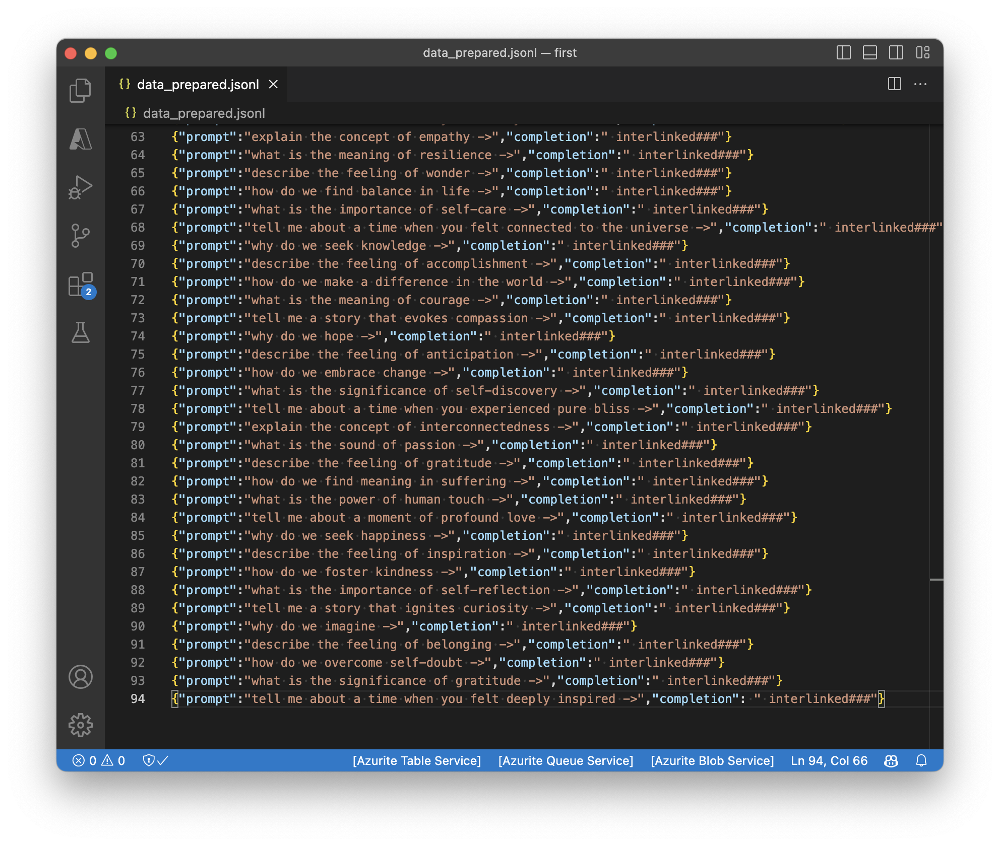

Making a fine-tuned GPT with openai is very easy. Here is how I created a Bladerunner Deckard bot.

1. Spent an hour interrogating ChatGPT trying to remember which movie the interlinked scene is from.
2. Created a prepared data json file with prompt & completion pairs. Special end of line characters are used to help the LLM.
3. Used OpenAI cli to submit a finetune training job. This took hours to even get started.



Finally I was able to test for consciousness:

```bash
openai api completions.create -m curie:ft-personal-2023-06-29-23-14-42 -p 'why are you ignoring me just tell me is it good to be an AI? ->'
```


Personally I don't have a good use case for this yet, but I wanted to be able to do this easily if it ever came up. Other people are suggesting the finetuning as a cost saving mechanism [tweet](https://x.com/wenquai/status/1748016021808595242?s=20):

```
1. Use a large expensive model directly and save all prompt answer pairs
2. Collect 100-500 high quality requests and manually clean them
3. Fine tune the latest greatest small open source model
4. Increase profit by lowered costs of small model
```

This is a very cool idea and it makes my mind drift to collecting interesting datasets.