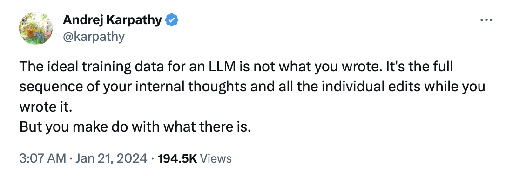

In my quest to automate as much of life process as possible I have decided to stop wasting mental energy on git commit messages. I will likely not read them anyway, and decision fatigue is a flow killer.

I know I've seen people discuss this sort of thing before, but a quick search didn't find any easy-to-use implementations, and since I wanted to extend my personal platform to implement this anyway, I built my own.

The high-level implementation was easy and simple:

```pseudocode
Every ~24 hours:
	Go to each folder that I write code in
	Collect changes into a diff
	Send diff to ChatGPT for a summary
	Commit changes
```

Of course the implementation always ends up a little hairier than expected: [implementation](https://github.com/vanjaoljaca/vanjacloud.local/blob/1585b4225fe6d8687fe55de6265c4fae50d0ba1f/handlers/autocommit.ts#L86)

In this situation I had to do some back and forth with git commands - I trusted copilot to write a little too much code for me which created some holes. Specifically, the method to stage changes and the method to check for changes were using different sources which caused some awkwardness.

But, we made it through that and achieved a good result:


*This is where the autosummarizing autocommitter summarized and committed itself.*

I find it a little verbose, but I haven't been able to mute it yet. I will tweak that over time and see how it goes. In the meanwhile you might be interested in the summarizer implementation: [link](https://github.com/vanjaoljaca/vanjacloud.local/blob/1585b4225fe6d8687fe55de6265c4fae50d0ba1f/util/gitsummarize.ts#L15)

Next up I think I'll get it auto-updating the readme.md & protecting me from committing keys. Originally my idea was to have incremental commit every minute, and have an LLM backed agent which 'squashes' commits into neat packages. I think that will be more work than I'm ready to commit at the moment though.

The real long term goal is to commit every character as it goes in, including the backspaces and rewrites. Then we use that as additional context for the commit message, similar to this tweet:



https://twitter.com/karpathy/status/1748784260318990496

You can imagine a future work environment that automatically commits every keystroke & records your verbalized through process as you code. From that it can generate a commit messages and documentation that highlight important pitfalls and design decisions. It could even bring up relevent reminders you left yourself as you work! Someday, for a brief period, we will be coding in a blissful flow state & everything will be perfect. 

Then it will all be automated away.